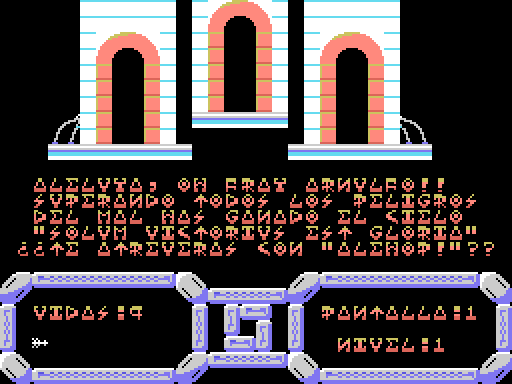
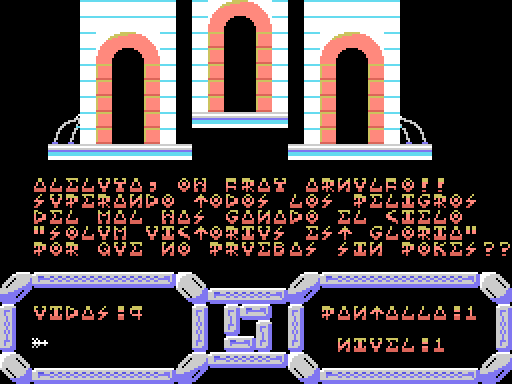

# Findings

Things that turned up while taking the game apart and that, as far as we have
been able to check, were not documented anywhere. Each one comes with the
evidence behind it, so that anyone can verify it.

---

## The cheater's punishment

In the binary, at address `0x7F94`, there is this sentence:

> POR QUE NO PRUEBAS SIN POKES

(«Why don't you try it without pokes».) It is not a stray message or a debug
string. The routine that uses it sits at `0x8B80`, and it is part of the
**end-of-game** sequence:

```asm
FINAL_JUEGO:
    ld a,(08f0dh)       ; avanza a la pantalla 28, la de victoria
    inc a
    ld (08f0dh),a
    call CARGA_MAPA     ; la carga como cualquier otra pantalla
    call VUELCA_BUFFER
    call INIT_PANTALLA  ; y la enciende

CASTIGO_TRAMPAS:
    ld a,(08f1eh)       ; bandera de tramposo
    cp 000h
    jp z,BUCLE_FINAL    ; si esta limpia, final normal
    ld hl,07f94h        ; si no: el reproche...
    ld de,019e0h        ; ...encima de la ultima linea del area de juego
    ld bc,00020h
    call 0005ch
```

In other words: you have cleared all 28 screens, you reach the victory screen
with its *«Aleluya, oh fray Arnulfo»*, and instead of letting you enjoy it the
game writes the telling-off right on top of it. A punishment saved for the very
end.

### Which line it wipes out, exactly

We forced the end of the game in the emulator, once with the flag clear and once
with it set by hand, and compared the last line of the play area:

```
legitimate ending:  ¿TE ATREVERAS CON "ALEHOP!"?
with the cheat:     POR QUE NO PRUEBAS SIN POKES
```

The telling-off does not land in free space: **it replaces exactly the line
where the game invites you to play *Alehop***, the company's next title. The
cheater has the invitation taken away.





### And it never fires

We searched all four of the game's binaries for any instruction that writes to
`0x8F1E`, in every form: `ld (0x8F1E),a`, `ld hl,0x8F1E`, `ld de,…`,
`ld bc,…`. **The only reference in the whole game is the read at 0x8B80.**
No write, anywhere.

The flag is zero on a clean tape and stays zero with the game running, so the
punishment never triggers.

### And now the good part: they forgot to initialise it

At first we assumed Topo had left the trap «armed and waiting». Looking at the
data more carefully, the explanation is different, and quite a bit better.

The game's start-up initialises fifteen variables, one after another:

```
8F09 8F0A 8F0B 8F0C 8F0D 8F0E 8F11 8F12 8F13 8F14 8F17 8F18 8F19 8F1C 8F1D
```

One is missing. **0x8F1E is the only variable the game reads and never
initialises**, and it sits right next to 0x8F1C and 0x8F1D, which are
initialised. That is precisely the one they skipped.

So why is it zero, then? Because the tape loads something there, and that
something happens to be a zero. But it is not an initialisation: it is
**padding**. The area 0x8F00-0x8FA0 comes filled with leftover bytes from the
animation tables — you can recognise them because they alternate pattern values
with colour bytes of the `0x04`, `0x14`, `0x34` kind — and out of those 160
bytes **only three are zero**. One of them, by pure chance, falls exactly on
0x8F1E.

That is: **the punishment fails to fire by sheer luck**. If the padding had left
any other value there — and there was a 98% chance of that — the check would
have come out non-zero and *everybody* who finished the game would see the
telling-off, without having cheated at all.

So what we have here is not a clever trap but a **lucky bug**: they wrote the
check, forgot to zero the variable, and the randomness of the padding saved them
from having their own game insult every honest player.

---

## A 1988 misprint

The only published cheat for *Temptations* appeared in **MSX Book II**
(Paulisoft, Brazil, 1988), page 62, in a loader signed `BY MBCF/88`. It says:

```basic
POKE &HB4CC,0
```

**It does nothing.** In the game's binary, address `0xB4CC` already holds a
zero: the poke writes a zero over a zero.

The correct address is `0x84CC`, which holds `0x3D` — the `DEC A` instruction
inside the routine that takes a life away:

```asm
QUITA_VIDA:
    ld a,(08f12h)   ; A = vidas actuales
    dec a           ; <-- 0x84CC. Poniendo 0x00 aqui (NOP), A no cambia
    cp 0ffh
    jp z,GAME_OVER
    ld (08f12h),a
```

In the dot-matrix type used in those books, `8` and `B` are almost the same
glyph. We compared the printed character with the `8` in "88" and the `B` in
"BLOAD" on the same page: it is an `8` that was badly scanned or badly typeset.

**Verified in the emulator.** We forced the routine to run with and without the
patch:

| | Lives before | Lives after |
|---|---|---|
| Without the patch | 9 | 8 |
| With `0x84CC = 0x00` | 9 | **9** |

So the cheat published in 1988 had one digit wrong, and the good one is
`POKE &H84CC,0`.

---

## Why the water in level 4 is green

Level 4 is underwater: Fray Arnulfo turns into a fish, gravity disappears and
you can swim freely. The interesting bit is how the background is done.

On the MSX video chip, the TMS9918, **colour 0 is not black: it is
transparent**. Wherever a tile uses colour 0, what shows through is the backdrop
colour, which is a single VDP register.

The game takes advantage of that. On entering level 4:

```asm
ENTRA_NIVEL4:
    call EMPIEZA_NIVEL
    ld a,00ch           ; color 12 = verde
    ld (0f3ebh),a       ; en el registro de color de fondo
    call 00062h         ; BIOS CHGCLR: aplicalo
    ld a,001h
    ld (08f11h),a       ; y enciende el modo flotar
```

One byte. With that, every transparent area of every tile goes from black to
green all at once, and the whole level turns into the bottom of the sea without
a single graphic having changed.

This finding came out of an observation by a veteran player: on seeing the maps
we had drawn he said *«the underwater ones are wrong, the background is green»*.
He was right: our program was painting colour 0 as black. Looking for whoever
touched the backdrop register turned up the `ld a,00ch` above.

---

## The maps: 29 screens of 512 bytes

Each screen of the game is a 512-byte block starting at `0x9000`: 32 columns by
16 rows, one tile byte per cell, row by row. No compression.

The arithmetic is right there in the routine that loads them:

```asm
CARGA_MAPA:
    ld a,(08f0dh)   ; A = numero de pantalla
    ld d,a
    sla d           ; SLA D con E=0 deja DE = pantalla * 512
    ld e,000h
    ld hl,09000h    ; base de la tabla de mapas
    add hl,de
    ld de,07d80h    ; buffer del mapa en RAM
    ld bc,00200h    ; 512 bytes
    ldir
```

There are **29** blocks: the 28 playable screens (4 levels × 7) plus the victory
one.

We verified this two ways. First by comparing memory: with the game stopped on
screen 0, the 512 bytes at `0x9000` match **byte for byte** what is in VRAM. And
second by drawing them: if the format were wrong we would get noise, and instead
we get perfectly recognisable game screens. They are in
[pantallas.html](pantallas.html).

---

## Four levels of seven screens, straight from the code

The structure of the game does not have to be guessed at. The routine that
decides what happens when a screen is finished says it:

```asm
FIN_DE_PANTALLA:
    ld a,(08f0dh)       ; pantalla que se acaba de terminar
    cp 00dh             ; 13 -> entra al nivel 3
    jp z,ENTRA_NIVEL3
    cp 014h             ; 20 -> entra al nivel 4
    jp z,ENTRA_NIVEL4
    cp 01bh             ; 27 -> se acabo el juego
    jp z,FINAL_JUEGO
    cp 006h             ; 6  -> entra al nivel 2
    jp z,L_8B23
    jp CAMBIO_PANT_NORMAL
```

6, 13, 20 and 27. The cuts come every seven screens: 0-6, 7-13, 14-20, 21-27.

---

## U and V are the same drawing

The game does not use ASCII: it has its own character table. Space is code 0
(not 32), the digits start at 0x5C and the punctuation lives around 0x68.

Reading the texts out of the binary turns up things like `PVES SERES HORRIBLES`,
`DE NUEUO SOBRE TI` or `MVSICA:GOMINOLAS` — that is, PUES, NUEVO and MÚSICA.
They look like typos, but on screen they read perfectly.

The reason is that **the codes for 'U' and 'V' draw exactly the same glyph**. It
makes no difference which one you type: the same letter comes out. Whoever typed
the texts in used one or the other without distinction.

Along the way, the character table was confirmed by two independent routes: on
one hand by drawing the glyphs, and on the other because the code itself does
`ld b,05Ch` + `add a,b` to turn a number into a digit, which pins 0x5C down as
the '0'.

---

## A nod to another game from the same publisher

The ending text, in full, reads:

> ALELUYA, OH FRAY ARNULFO. SUPERANDO TODOS LOS PELIGROS DEL MAL HAS GANADO EL
> CIELO. "SOLUM VICTORIUS EST GLORIA". ¿TE ATREVERÁS CON "ALEHOP"?

(«Hallelujah, oh Brother Arnulfo. Having overcome all the perils of evil you
have won heaven. "SOLUM VICTORIUS EST GLORIA". Will you dare take on
"ALEHOP"?»)

*Alehop* was another Topo Soft game. The victory screen ends up selling you the
next one.

And a minor curiosity: the game's manual calls the main character **Hermano
Nonato, «Noni»**, but the text that appears on screen says **Fray Arnulfo**.
Somewhere between design and printing, the monk changed his name.

---

## Leftovers from another build

Between `0xCA00` and `0xD000` there are 1,536 bytes that are **real code**: they
disassemble without trouble and the routines make sense. But they never run.

It is an earlier version of some routines that stayed behind in the binary. And
it is a dangerous trap for anyone disassembling: we fell for it. An automatic
jump-table detector flagged them as game code, we eyeballed them and they did
indeed *look* like correct code, and in they went. It took a later review to
realise that nobody calls them.

The lesson got written down in the project: a chunk disassembling coherently is
no proof that it ever runs.

---

## And the bytes nobody touches

At the end of the analysis there were 642 bytes left unexplained. We settled
them by putting memory watchpoints on every one of them and playing a full game
in the emulator — with infinite lives and pushing the monk against the right-hand
edge, so as to run through all four levels up to screen 27.

- **96 bytes** were the **stack**: they took writes from 557 different
  addresses, including the BASIC ROM itself. Only the back-and-forth of `PUSH`
  and `POP` produces that pattern.
- **1 byte** was a sound-effect slot we had not counted.
- **543 bytes** were not touched by anything for the whole game. Among them, two
  orphan `RET`s: return instructions that no path ever reaches, because the
  routine before them already ends with one of its own.
